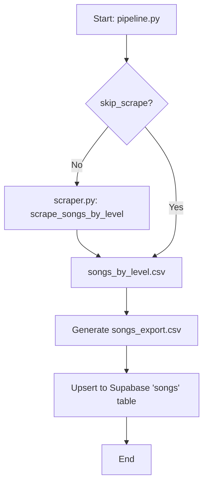

# Arcaea Charts (Fandom) Data

Single scraper for Arcaea Fandom wiki data. Uses the MediaWiki API to fetch song metadata without direct HTML scraping.

```bash
# Scrape the Songs by Level page → CSV (Song, Artist, Difficulty, Chart Constant, Level, Version)
python scraper.py -o songs_by_level.csv
```

## Pipeline (Scrape → Supabase)

One command to scrape "Songs by Level" and upsert metadata rows into the Supabase `songs` table (no images):

```bash
python pipeline.py
```



Optional: `--skip-scrape` to reuse existing `songs_by_level.csv`.
Requires `SUPABASE_URL` and `SUPABASE_SERVICE_ROLE_KEY` in the environment or in `.env`.

## GitHub Actions (automated sync)

The pipeline can run on a schedule or on demand via GitHub Actions. The workflow uses the **PROD** environment.

- **Triggers:** Daily at 4:00 UTC (cron) and manual run from the Actions tab (`workflow_dispatch`).
- **PROD environment:** In **Settings → Secrets and variables → Actions**, open **Environments** and select **PROD**. Then:
  - **Variables:** `SUPABASE_URL`, `SUPABASE_SERVICE_ROLE_KEY`.

Do not commit `.env`; the workflow uses these secrets as environment variables. After pushing the workflow file (`.github/workflows/sync-songs.yml`) and setting secrets, run the “Sync songs to Supabase” workflow once manually from the Actions tab to verify.

## Development and linting

- **Lint:** Run `pylint scraper.py pipeline.py update_image_urls.py`. The project uses [.pylintrc](.pylintrc) (e.g. `max-line-length=120`). Fix all errors and warnings before committing.
- **CI:** The [Lint](.github/workflows/lint.yml) workflow runs pylint on every push and pull request. The [Sync songs to Supabase](.github/workflows/sync-songs.yml) workflow also runs pylint before the pipeline so scheduled and manual syncs fail fast if the code doesn’t pass lint.
- **Pre-commit (optional):** To run pylint automatically before each commit, install [pre-commit](https://pre-commit.com/) and add a local hook that runs the pylint command above.
- **AI / agents:** The repo includes [.cursor/rules/lint-and-style.mdc](.cursor/rules/lint-and-style.mdc) so Cursor (and similar tools that read project rules) are instructed to run pylint and follow the project’s style when editing Python.
