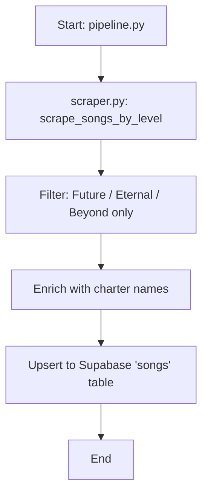

# Charter Scraping Implementation Plan

> **For agentic workers:** REQUIRED SUB-SKILL: Use superpowers:subagent-driven-development (recommended) or superpowers:executing-plans to implement this plan task-by-task. Steps use checkbox (`- [ ]`) syntax for tracking.

**Goal:** Scrape chart designer names from the Chart_Designers wiki page and enrich each song row with a `charter` field before upserting to Supabase.

**Architecture:** A new `scrape_chart_designers()` function in `scraper.py` fetches the Chart_Designers page, parses all designer tables, and returns a lookup dict keyed on `(normalized_title, difficulty)`. The pipeline calls this once, then enriches each row during the build step. A new nullable `charter` text column is added to the Supabase `songs` table.

**Tech Stack:** Python 3.12, BeautifulSoup, Supabase (PostgreSQL), MediaWiki API

---

### Task 1: Supabase Migration

**Files:**
- Create: `supabase/migrations/001_add_charter_column.sql`

- [ ] **Step 1: Create migration file**

```sql
ALTER TABLE songs ADD COLUMN IF NOT EXISTS charter text;
```

- [ ] **Step 2: Run migration against Supabase**

Run this SQL in the Supabase SQL Editor (Dashboard → SQL Editor → New query → paste → Run). Verify the column appears in the `songs` table schema.

- [ ] **Step 3: Commit**

```bash
git add supabase/migrations/001_add_charter_column.sql
git commit -m "feat: add charter column migration"
```

---

### Task 2: Add `scrape_chart_designers()` to scraper.py

**Files:**
- Modify: `scraper.py` (add constant at line ~27, add function after `filter_song_pages` at line ~143)

- [ ] **Step 1: Add the difficulty abbreviation map constant**

Add after `REQUEST_TIMEOUT = 30` (line 27):

```python
CHART_DESIGNERS_PAGE = "Chart_Designers"
DIFF_ABBREV_MAP = {
    "FTR": "Future",
    "ETR": "Eternal",
    "BYD": "Beyond",
}
KEPT_DIFFICULTIES = set(DIFF_ABBREV_MAP.values())
```

- [ ] **Step 2: Add the `_parse_designer_difficulties` helper**

Add in a new section after `filter_song_pages()` (after line 142), before the CSV Helper section:

```python
# -----------------------------------------------------------------------------
# Chart Designers (Chart_Designers page)
# -----------------------------------------------------------------------------

def _parse_designer_difficulties(notes_text):
    """Parse difficulty abbreviations from a Chart_Designers Notes cell.

    Args:
        notes_text: Raw text from the Notes column, e.g. "FTR; joint work with X"
            or "PST/PRS/FTR" or "" (empty = all kept difficulties).

    Returns:
        Set of full difficulty names that we care about (Future/Eternal/Beyond).
    """
    if not notes_text.strip():
        return set(KEPT_DIFFICULTIES)

    # Take text before semicolon (strips "; joint work with..." etc.)
    abbrev_part = notes_text.split(";")[0].strip()

    result = set()
    for token in re.split(r"[/,\s]+", abbrev_part):
        token = token.strip().upper()
        if token in DIFF_ABBREV_MAP:
            result.add(DIFF_ABBREV_MAP[token])
    return result
```

- [ ] **Step 3: Add the `scrape_chart_designers` function**

Add directly after `_parse_designer_difficulties`:

```python
def scrape_chart_designers():
    """Scrape the Chart_Designers wiki page and build a charter lookup.

    Returns:
        Dict mapping (normalized_title, difficulty) -> charter_name.
        Title normalization: .strip().lower()
    """
    print(f"Fetching {CHART_DESIGNERS_PAGE} via API...")
    html = fetch_page_via_api(CHART_DESIGNERS_PAGE)
    soup = BeautifulSoup(html, "html.parser")

    lookup = {}
    tables = soup.select("table.article-table")

    for table in tables:
        trs = table.select("tr")
        if not trs:
            continue
        # Skip header row
        current_song = ""
        remaining_rowspan = 0

        for tr in trs[1:]:
            tds = tr.select("td")
            if not tds:
                continue

            if remaining_rowspan > 0:
                # Song cell is spanned from a previous row; tds[0] is Name, tds[1] is Notes
                remaining_rowspan -= 1
                if len(tds) < 2:
                    continue
                charter_name = tds[0].get_text(strip=True)
                notes_text = tds[1].get_text(strip=True)
            else:
                # Normal row: tds[0] is Song, tds[1] is Name, tds[2] is Notes
                if len(tds) < 3:
                    continue
                song_cell = tds[0]
                rowspan = song_cell.get("rowspan")
                if rowspan:
                    remaining_rowspan = int(rowspan) - 1
                song_link = song_cell.select_one("a")
                current_song = (song_link.get_text(strip=True) if song_link
                                else song_cell.get_text(strip=True))
                charter_name = tds[1].get_text(strip=True)
                notes_text = tds[2].get_text(strip=True)

            if not current_song or not charter_name:
                continue

            norm_title = current_song.strip().lower()
            difficulties = _parse_designer_difficulties(notes_text)
            for diff in difficulties:
                lookup[(norm_title, diff)] = charter_name

    print(f"Built charter lookup with {len(lookup)} entries.")
    return lookup
```

- [ ] **Step 4: Verify scraper runs without errors**

Run: `python3 -c "from scraper import scrape_chart_designers; d = scrape_chart_designers(); print(f'{len(d)} entries'); print(list(d.items())[:5])"`

Expected: prints entry count and 5 sample `(title, difficulty) -> name` pairs.

- [ ] **Step 5: Run pylint**

Run: `python3 -m pylint scraper.py`

Expected: no new warnings beyond pre-existing ones.

- [ ] **Step 6: Commit**

```bash
git add scraper.py
git commit -m "feat: add scrape_chart_designers() for charter name lookup"
```

---

### Task 3: Integrate charter lookup into pipeline.py

**Files:**
- Modify: `pipeline.py` (line 14 import, lines 62-146 run_pipeline)

- [ ] **Step 1: Update the import**

Change line 14:

```python
# Before:
from scraper import scrape_songs_by_level, fetch_song, scrape_news_links, filter_song_pages

# After:
from scraper import (
    scrape_songs_by_level, fetch_song, scrape_news_links, filter_song_pages,
    scrape_chart_designers,
)
```

- [ ] **Step 2: Call `scrape_chart_designers()` in `run_pipeline()`**

Add after the gap-check `except` block (after line 114), before the `# 2. Build rows` comment:

```python
    # 1c. Scrape chart designer names
    charter_lookup = {}
    try:
        charter_lookup = scrape_chart_designers()
        logger.info("Loaded %d charter entries.", len(charter_lookup))
    except Exception as e:
        logger.error(f"Charter scraping failed: {e}")
```

- [ ] **Step 3: Enrich rows with charter in the row loop**

After the difficulty filter (after line 144 `continue`), before the `key = ...` line, add the charter lookup:

```python
        norm_title = r["title"].strip().lower()
        r["charter"] = charter_lookup.get((norm_title, r["difficulty"]))
```

So lines 143-146 become:

```python
        if r["difficulty"] not in {"Future", "Eternal", "Beyond"}:
            continue
        norm_title = r["title"].strip().lower()
        r["charter"] = charter_lookup.get((norm_title, r["difficulty"]))
        key = (r["title"], r["artist"], r["difficulty"])
        unique_rows[key] = r
```

- [ ] **Step 4: Verify pipeline runs end-to-end**

Run: `python3 pipeline.py`

Expected: pipeline completes, logs show "Loaded N charter entries", upsert succeeds. Spot-check in Supabase that some rows have non-null `charter` values.

- [ ] **Step 5: Run pylint**

Run: `python3 -m pylint pipeline.py`

Expected: no new warnings beyond pre-existing ones.

- [ ] **Step 6: Commit**

```bash
git add pipeline.py
git commit -m "feat: enrich song rows with charter name from Chart_Designers page"
```

---

### Task 4: Update README and docs

**Files:**
- Modify: `README.md` (mermaid diagram, lines 13-19)

- [ ] **Step 1: Update mermaid diagram**

Replace the mermaid block:

```markdown

```

- [ ] **Step 2: Commit**

```bash
git add README.md
git commit -m "docs: add charter enrichment step to pipeline diagram"
```

---
